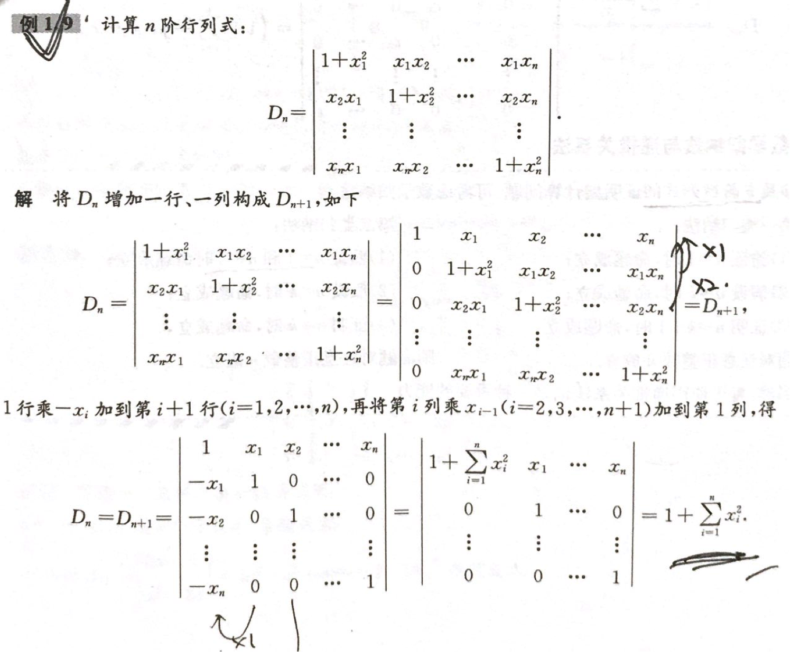

# 格基規約算法

## Lenstra–Lenstra–Lovasz

### 基本介紹

LLL 算法就是在格上找到一組基，滿足如下效果

而且，這種方法生成的基所具有的如下性質是非常有用的

### 簡單應用

這裏我舉一下 LLL paper 中給的第二個例子。給定 n 個實數 $\alpha_i,...,\alpha_n$，找到這 n 個數的有理線性逼近，即找到 n 個數 $m_i$，使得 $\sum\limits_{i=1}^{n}m_i\alpha_i$ 儘可能等於 0。 我們可以構造這樣的矩陣，這裏 $a_i$ 爲 $\alpha_i$ 的有理逼近。

$$ A = \left[ \begin{matrix} 1   & 0 & 0     & \cdots & 0 & ca_1     \\ 0   & 1  & 0    & \cdots & 0 & c a_2  \\ 0   & 0   & 1   & \cdots & 0 & c a_3 \\\vdots & \vdots & \vdots & \ddots & \vdots \\ 0   & 0   &0   & \cdots & 1 & c a_n     \\ \end{matrix} \right]$$

矩陣爲 n*(n+1) 的，我們可以根據格求行列式的方法來求一下這個格對應的行列式。

$det(L)=\sqrt{AA^T}$

我們進一步考慮這樣的矩陣

$$ A = \left[ \begin{matrix} 1   & 0 & 0     & \cdots & 0 & a_1     \\ 0   & 1  & 0    & \cdots & 0 & a_2  \\ 0   & 0   & 1   & \cdots & 0 & a_3 \\\vdots & \vdots & \vdots & \ddots & \vdots \\ 0   & 0   &0   & \cdots & 1 & a_n     \\ \end{matrix} \right]$$

那麼

$$ AA^T = \left[ \begin{matrix} 1+a_1^2   & a_1a_2   & a_1a_3 & \cdots  & a_1a_n     \\ a_2a_1   & 1+a_2^2  & a_2a_3 & \cdots & a_2a_n  \\ a_3a_1   & a_3a_2   & 1+a_3^2   & \cdots  & a_3a_n \\ \vdots & \vdots & \vdots & \ddots & \vdots \\ a_na_1   & a_na_2   &a_na_3   & \cdots  & 1+a_n^2     \\ \end{matrix} \right]$$

進一步我們從低維到高維大概試一試（嚴格證明，可以考慮添加一行和一列，左上角爲1），得到格的行列式爲

$\sqrt{1+\sum\limits_{i=1}^n\alpha_i^2}$

可以參見考研宇哥的如下證明

那麼經過 LLL 算法後，我們可以獲得

$||b_1|| \leq 2^{\frac{n-1}{4}} (1+\sum\limits_{i=1}^n\alpha_i^2)^{\frac{1}{2n}}$

一般來說後一項在開 n 次方時趨向於1，因爲 $a_i$ 都是常數，一般不會和 n 相關，所以

$||b_1|| \leq 2^{\frac{n-1}{4}}*k$

k 比較小。此外，$b_1$ 又是原向量的線性組合，那麼

$b_1[n]=\sum\limits_{i=1}^{n}m_ic*a_i=c\sum\limits_{i=1}^{n}m_i*a_i$

顯然如果 c 足夠大，那麼後面的求和必須足夠小，纔可以滿足上面的約束。

## 參考

- Survey: Lattice Reduction Attacks on RSA
