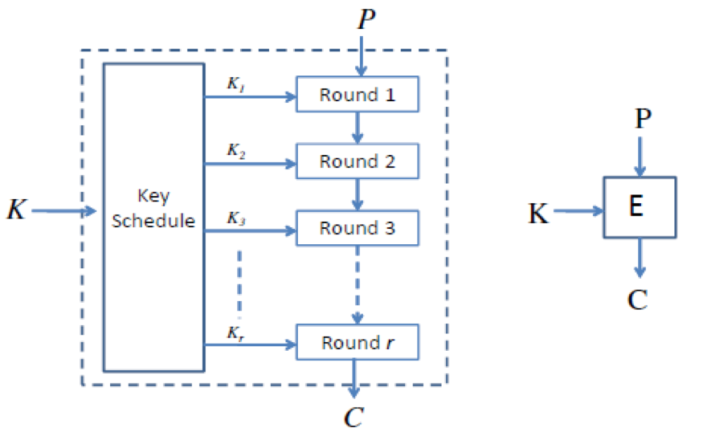

# 塊加密

## 概述

所謂塊加密就是每次加密一塊明文，常見的加密算法有

- IDEA 加密
- DES 加密
- AES 加密

塊加密也是對稱加密。

其實，我們也可以把塊加密理解一種特殊的替代密碼，但是其每次替代的是一大塊。而正是由於一大塊，明文空間巨大，而且對於不同的密鑰，我們無法做一個表進行對應相應的密文，因此必須得有 **複雜** 的加解密算法來加解密明密文。

而與此同時，明文往往可能很長也可能很短，因此在塊加密時往往需要兩個輔助

- padding，即 padding 到指定分組長度
- 分組加密模式，即明文分組加密的方式。

## 基本策略

在分組密碼設計時，充分使用了 Shannon 提出的兩大策略：混淆與擴散兩大策略。

### 混淆

混淆，Confusion，將密文與密鑰之間的統計關係變得儘可能複雜，使得攻擊者即使獲取了密文的一些統計特性，也無法推測密鑰。一般使用複雜的非線性變換可以得到很好的混淆效果，常見的方法如下

- S 盒
- 乘法

### 擴散

擴散，Diffusion，使得明文中的每一位影響密文中的許多位。常見的方法有

- 線性變換
- 置換
- 移位，循環移位

## 常見加解密結構

目前塊加密中主要使用的是結構是

- 迭代結構，這是因爲迭代結構便於設計與實現，同時方便安全性評估。

### 迭代結構

#### 概述

迭代結構基本如下，一般包括三個部分

- 密鑰置換
- 輪加密函數
- 輪解密函數

#### 輪函數

目前來說，輪函數主要有主要有以下設計方法

- Feistel Network，由 Horst Feistel 發明，DES 設計者之一。
    - DES
- Substitution-Permutation Network(SPN)
    - AES
- 其他方案

#### 密鑰擴展

目前，密鑰擴展的方法有很多，沒有見到什麼完美的密鑰擴展方法，基本原則是使得密鑰的每一個比特儘可能影響多輪的輪密鑰。
