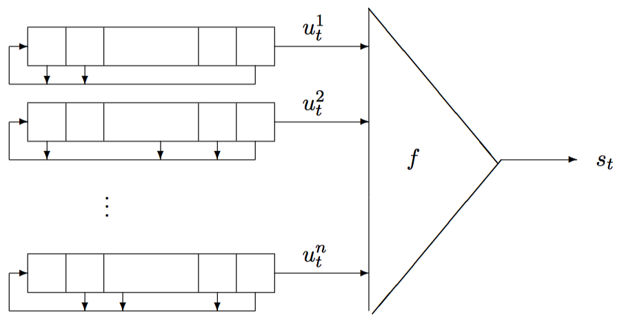

# 非線性反饋移位寄存器

## 介紹

爲了使得密鑰流輸出的序列儘可能複雜，會使用非線性反饋移位寄存器，常見的有三種

- 非線性組合生成器，對多個 LFSR 的輸出使用一個非線性組合函數
- 非線性濾波生成器，對一個 LFSR 的內容使用一個非線性組合函數
- 鍾控生成器，使用一個（或多個）LFSR 的輸出來控制另一個（或多個）LFSR 的時鐘 

## 非線性組合生成器

### 簡介

組合生成器一般如下圖所示。



###  Geffe

這裏我們以 Geffe 爲例進行介紹。Geffe 包含 3 個線性反饋移位寄存器，非線性組合函數爲

$F(x_1,x_2,x_3)=(x_1 \and x_2) \oplus (\urcorner x_1 \and x_3)=(x_1 \and x_2) \oplus ( x_1 \and x_3)\oplus x_3$

#### 2018 強網杯 streamgame3

簡單看一下題目

```python
from flag import flag
assert flag.startswith("flag{")
assert flag.endswith("}")
assert len(flag)==24

def lfsr(R,mask):
    output = (R << 1) & 0xffffff
    i=(R&mask)&0xffffff
    lastbit=0
    while i!=0:
        lastbit^=(i&1)
        i=i>>1
    output^=lastbit
    return (output,lastbit)


def single_round(R1,R1_mask,R2,R2_mask,R3,R3_mask):
    (R1_NEW,x1)=lfsr(R1,R1_mask)
    (R2_NEW,x2)=lfsr(R2,R2_mask)
    (R3_NEW,x3)=lfsr(R3,R3_mask)
    return (R1_NEW,R2_NEW,R3_NEW,(x1*x2)^((x2^1)*x3))

R1=int(flag[5:11],16)
R2=int(flag[11:17],16)
R3=int(flag[17:23],16)
assert len(bin(R1)[2:])==17
assert len(bin(R2)[2:])==19
assert len(bin(R3)[2:])==21
R1_mask=0x10020
R2_mask=0x4100c
R3_mask=0x100002


for fi in range(1024):
    print fi
    tmp1mb=""
    for i in range(1024):
        tmp1kb=""
        for j in range(1024):
            tmp=0
            for k in range(8):
                (R1,R2,R3,out)=single_round(R1,R1_mask,R2,R2_mask,R3,R3_mask)
                tmp = (tmp << 1) ^ out
            tmp1kb+=chr(tmp)
        tmp1mb+=tmp1kb
    f = open("./output/" + str(fi), "ab")
    f.write(tmp1mb)
    f.close()
```

可以看出，該程序與 Geffe 生成器非常類似，這裏我們使用相關攻擊方法進行攻擊，我們可以統計一下在三個 LFSR 輸出不同的情況下，最後類 Geffe 生成器的輸出，如下

| $x_1$ | $x_2$ | $x_3$ | $F(x_1,x_2,x_3)$ |
| ----- | ----- | ----- | ---------------- |
| 0     | 0     | 0     | 0                |
| 0     | 0     | 1     | 1                |
| 0     | 1     | 0     | 0                |
| 0     | 1     | 1     | 0                |
| 1     | 0     | 0     | 0                |
| 1     | 0     | 1     | 1                |
| 1     | 1     | 0     | 1                |
| 1     | 1     | 1     | 1                |

可以發現

- Geffe 的輸出與 $x_1$ 相同的概率爲 0.75
- Geffe 的輸出與 $x_2$ 相同的概率爲 0.5
- Geffe 的輸出與 $x_3$ 相同的概率爲 0.75

這說明輸出與第一個和第三個的關聯性非常大。 因此，我們可以暴力去枚舉第一個和第三個 LFSR 的輸出判斷其與 類 Geffe 的輸出相等的個數，如果大約在 75% 的話，就可以認爲是正確的。第二個就直接暴力枚舉了。

腳本如下

```python
#for x1 in range(2):
#    for x2 in range(2):
#        for x3 in range(2):
#            print x1,x2,x3,(x1*x2)^((x2^1)*x3)
#n = [17,19,21]

#cycle = 1
#for i in n:
#    cycle = cycle*(pow(2,i)-1)
#print cycle


def lfsr(R, mask):
    output = (R << 1) & 0xffffff
    i = (R & mask) & 0xffffff
    lastbit = 0
    while i != 0:
        lastbit ^= (i & 1)
        i = i >> 1
    output ^= lastbit
    return (output, lastbit)


def single_round(R1, R1_mask, R2, R2_mask, R3, R3_mask):
    (R1_NEW, x1) = lfsr(R1, R1_mask)
    (R2_NEW, x2) = lfsr(R2, R2_mask)
    (R3_NEW, x3) = lfsr(R3, R3_mask)
    return (R1_NEW, R2_NEW, R3_NEW, (x1 * x2) ^ ((x2 ^ 1) * x3))


R1_mask = 0x10020
R2_mask = 0x4100c
R3_mask = 0x100002
n3 = 21
n2 = 19
n1 = 17


def guess(beg, end, num, mask):
    ansn = range(beg, end)
    data = open('./output/0').read(num)
    data = ''.join(bin(256 + ord(c))[3:] for c in data)
    now = 0
    res = 0
    for i in ansn:
        r = i
        cnt = 0
        for j in range(num * 8):
            r, lastbit = lfsr(r, mask)
            lastbit = str(lastbit)
            cnt += (lastbit == data[j])
        if cnt > now:
            now = cnt
            res = i
            print now, res
    return res


def bruteforce2(x, z):
    data = open('./output/0').read(50)
    data = ''.join(bin(256 + ord(c))[3:] for c in data)
    for y in range(pow(2, n2 - 1), pow(2, n2)):
        R1, R2, R3 = x, y, z
        flag = True
        for i in range(len(data)):
            (R1, R2, R3,
             out) = single_round(R1, R1_mask, R2, R2_mask, R3, R3_mask)
            if str(out) != data[i]:
                flag = False
                break
        if y % 10000 == 0:
            print 'now: ', x, y, z
        if flag:
            print 'ans: ', hex(x)[2:], hex(y)[2:], hex(z)[2:]
            break


R1 = guess(pow(2, n1 - 1), pow(2, n1), 40, R1_mask)
print R1
R3 = guess(pow(2, n3 - 1), pow(2, n3), 40, R3_mask)
print R3
R1 = 113099
R3 = 1487603

bruteforce2(R1, R3)
```

運行結果如下

```shell
➜  2018-CISCN-start-streamgame3 git:(master) ✗ python exp.py
161 65536
172 65538
189 65545
203 65661
210 109191
242 113099
113099
157 1048576
165 1048578
183 1048580
184 1049136
186 1049436
187 1049964
189 1050869
190 1051389
192 1051836
194 1053573
195 1055799
203 1060961
205 1195773
212 1226461
213 1317459
219 1481465
239 1487603
1487603
now:  113099 270000 1487603
now:  113099 280000 1487603
now:  113099 290000 1487603
now:  113099 300000 1487603
now:  113099 310000 1487603
now:  113099 320000 1487603
now:  113099 330000 1487603
now:  113099 340000 1487603
now:  113099 350000 1487603
now:  113099 360000 1487603
ans:  1b9cb 5979c 16b2f3
```

從而 flag 爲 flag{01b9cb05979c16b2f3}。

## 題目

- 2017 WHCTF Bornpig
- 2018 Google CTF 2018 Betterzip

## 參考

- https://www.rocq.inria.fr/secret/Anne.Canteaut/MPRI/chapter3.pdf
- http://data.at.preempted.net/INDEX/articles/Correlation_Attacks_Geffe.pdf