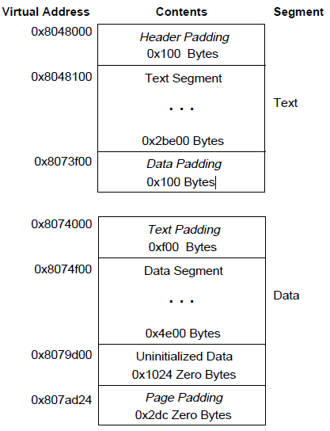
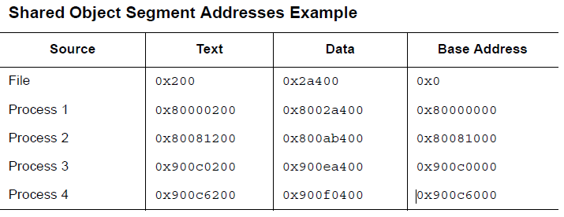

# 程序加載

程序加載過程其實就是系統創建或者擴充進程鏡像的過程。它只是按照一定的規則把文件的段拷貝到虛擬內存段中。進程只有在執行的過程中使用了對應的邏輯頁面時，纔會申請相應的物理頁面。通常來說，一個進程中有很多頁是沒有被引用的。因此，延遲物理讀寫可以提高系統的性能。爲了達到這樣的效率，可執行文件以及共享目標文件所擁有的段的文件偏移以及虛擬地址必須是合適的，也就是說他們必須是頁大小的整數倍。

在 Intel 架構中，虛擬地址以及文件偏移必須是 4KB（或者更大的數且爲 2 的整數冪次）的整數倍。

下面是一個可執行文件加載到內存中佈局的例子

對應的代碼段以及數據段的解釋如下

在這個例子中，儘管代碼段和數據段在模4KB的意義下相等，但是仍然最多有4個頁面包含有不純的代碼或者數據。當然，實際中會取決於頁大小或者文件系統的塊大小。

- 代碼段的第一個頁包含了ELF頭，程序頭部表，以及其他信息。
- 代碼段的最後一頁包含了數據段開始部分的副本。
- 數據段的最後一頁包含了代碼段的最後部分的副本。至於多少，暫未說明。
- 數據段的最後一部分可能會包含與程序運行無關的信息。

邏輯上說，系統會對強制控制內存的權限，就好比每一個段的權限都是完全獨立的；段的地址會被調整，以便於確保內存中的每一個邏輯頁都只有一組類型的權限。在上面給出的例子中，文件的代碼段的最後一部分和數據段的開始部分都會被映射兩次：分別在數據段的虛擬地址以及代碼段的虛擬地址。

數據段的結尾需要好好處理沒有被初始化的數據，一般來說，系統要求它們以0開始。因此，如果一個文件的最後一頁包含不在邏輯頁中的信息，那麼剩下的數據必須被初始化爲0。剩下的三個頁中的雜質數據在邏輯上說並不是進程鏡像的一部分，系統可以選擇刪除它們。該文件對應的虛擬內存鏡像如下（假設每一頁大小爲4KB）

在加載段時，可執行文件與共享目標文件有所區別。可執行文件通常來說包含絕對代碼。爲了能夠使得程序正確執行，每一個段應該在用於構建可執行文件的虛擬地址處。因此，系統直接使用p_vaddr作爲虛擬地址。

另一方面，共享目標文件通常包含地址獨立代碼。這使得在不同的進程中，同一段的虛擬地址可能會有所不同，但這並不會影響程序的執行行爲。儘管系統會爲不同的進程選擇不同的虛擬地址，但是它仍舊維持了段的相對地址。因爲地址獨立代碼在不同的段中使用相對地址，因此在虛擬內存中的虛擬地址之間的差肯定和在文件中的相應的虛擬地址的差相同。下面給出了可能的對於同一共享目標文件不同進程的情況，描述了相對地址尋址，此外這個表還給出了基地址的計算方法。

