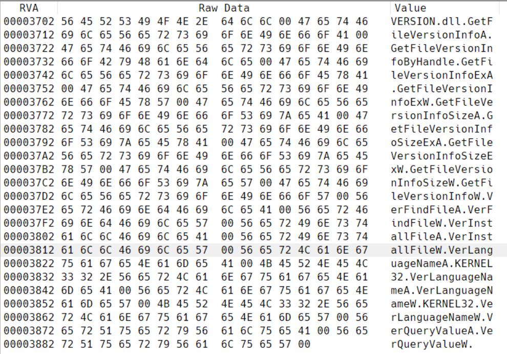

# 導出表

DLL 通過導出表向外界提供導出函數名稱，序號以及入口地址等信息。從導入角度來看，Windows 裝載器完善 IAT 時就是通過 DLL 的導出表讀取從其導入的函數的地址的。導出表通常存在於大多數 DLL 中，但在少數 EXE 文件中同樣存在。

對於 DLL 裏導出函數的調用，既可以通過函數名稱，也可以通過函數在導出表的索引進行。Windows 裝載器將與進程相關的 DLL 加載到虛擬地址空間後，會根據導入表中登記的與該 DLL 相關的名稱或編號來遍歷 DLL 的虛擬地址空間並查找導出表結構，從而確定該導出函數在虛擬地址空間中的起始地址 VA，並將該 VA 覆蓋寫入 IAT 對應項處。

## EAT

`DataDirectory[0]` 處保存者 EXPORT TABLE （即導出表）的 RVA。該 RVA 指向 `IMAGE_EXPORT_DIRECTORY` 結構體。PE 文件中最多隻存在 1 個 `IMAGE_EXPORT_DIRECTORY` 結構體。**但 PE 文件可以有多個 `IMAGE_IMPORT_DESCRIPTOR` 結構體，因爲 PE 文件可以一次導入多個庫。**

看看 `IMAGE_EXPORT_DIRECTORY` 結構體：

```c
typedef struct _IMAGE_EXPORT_DIRECTORY{
  DWORD    Characteristics;
  DWORD    TimeDateStamp;
  WORD     MajorVersion;
  WORD     MinorVersion;
  DWORD    Name;                     // 庫文件名稱地址
  DWORD    Base;                     // 導出函數起始序號
  DWORD    NumberOfFunctions;        // 導出函數個數
  DWORD    NumberOfNames;            // 導出函數的名稱個數
  DWORD    AddressOfFunctions;       // 導出函數地址數組（數組元素個數=NumberOfFunctions）
  DWORD    AddressOfNames;           // 導出函數名稱地址數組（數組元素個數=NumberOfNames）
  DWORD    AddressOfNameOrdinals;    // 導出函數序號數組（數組元素個數=NumberOfNames）
} IMAGE_EXPORT_DIRECTORY, *PIMAGE_EXPORT_DIRECTORY;
```

接下來詳細說明一下結構體中的成員：

- **`Name` 雙字。該成員保存的地址指向一個以 "\0" 結尾的字符串，字符串記錄的是導出表所在文件的最初文件名稱。**
- **`Base` 雙字。導出函數的起始序號。導出函數的編號 = Base + Ordinals。**
- **`NumberOfFunctions` 雙字。導出函數的總個數。**
- **`NumberOfNames0` 雙字。在導出表中，有些函數有定義名稱，有些函數沒有。該成員記錄了所有定義了名稱的導出函數的個數。如果該值爲 0，表示所有函數都沒有定義名稱。`NumberOfNames**` 總是小於等於 `NumberOfFunctions`。**
- **`AddressOfFunctions` 雙字。指向導出函數地址數組的起始處。導出函數地址數組保存了數量爲 `NumberOfFunctions` 的導出函數地址。**
- **`AddressOfNames` 雙字。指向導出函數名稱地址數組的起始處。導出函數名稱數組的每一個元素都指向了導出函數對應的名稱字符串的地址。**
- **`AddressOfNameOrdinals` 雙字。指向導出函數序號地址數組的起始處。與 `AddressOfNames` 是一一對應關係。導出函數序號數組中每一個元素都指向了導出函數對應的序號值。**

接下來通過一個簡單示例來學習一下。示例選取的是 Windows 系統中的 version.dll，該文件位於 `C:\Windows\SysWOW64\` 目錄下。
首先來看一下示例文件的 `IMAGE_EXPORT_DIRECTORY` 結構體：

```text
// 示例程序 IMAGE_EXPORT_DIRECTORY
RVA       Value      Description
----------------------------------------------------
00003630  00000000   Characteristicss
00003634  FDB2B236   Time Data Stamp
00003638  0000       Major Version
0000363A  0000       Minor Version
0000363C  00003702   Name RVA
00003640  00000001   Base
00003644  00000011   Number of Functions
00003648  00000011   Number of Names
0000364C  00003658   Address Table RVA
00003650  0000369C   Name Pointer Table RVA
00003654  000036E0   Ordinal Table RVA
----------------------------------------------------
```

接着整理一下導出表中的數組：

```text
RVA       Address   Name      Ordinal  Description
---------------------------------------------------------------------
00003658  000014F0  0000370E        0  GetFileVersionInfoA
0000365C  000022E0  00003722        1  GetFileVersionInfoByHandle
00003660  00001F40  0000373D        2  GetFileVersionInfoExA
00003664  00001570  00003753        3  GetFileVersionInfoExW
00003668  00001510  00003769        4  GetFileVersionInfoSizeA
0000366C  00001F60  00003781        5  GetFileVersionInfoSizeExA
00003670  00001590  0000379B        6  GetFileVersionInfoSizeExW
00003674  000015B0  000037B5        7  GetFileVersionInfoSizeW 
00003678  000015D0  000037CD        8  GetFileVersionInfoW
0000357C  00001F80  000037E1        9  VerFindFileA
00003680  00002470  000037EE       10  VerFindFileW
00003684  00001FA0  000037FB       11  VerInstallFileA
00003688  00002F40  0000380B       12  VerInstallFileW
0000368C  0000382C  0000381B       13  VerLanguageNameA
00003690  00003857  00003846       14  VerLanguageNameW
00003694  00001530  00003871       15  VerQueryValueA
00003698  00001550  00003880       16  VerQueryValueW
------------------------------------------------------------------------
```

Address 列對應着導出函數裝載到內存中的實際地址，Name 列對應着導出函數名稱的 RVA，Ordinal 即爲導出函數的序號。
這裏再加一張導出表的字符串部分內容，即保存着庫文件名稱和導出函數名稱的部分。通過 PEview 還能方便看出：



導出函數獲取函數地址的過程大致如下：

1. 首先利用 `AddressOfNames` 成員定位到導出函數名稱數組；
2. 接着通過比較字符串 (strcmp) 查找指定的函數名稱，找到後將其索引作爲 `name_index`；
3. 接着利用 `AddressOfOrdinals` 成員定位到導出函數序號數組；
4. 接着通過 `name_index` 在導出函數序號數組中定位對應的 `ordinal` 值；
5. 接着利用 `AddressOfFunctions` 成員定位到導出函數地址數組，即 `Export Address Table(EAT)`；
6. 最後通過 `ordinal` 作爲索引在導出函數地址數組中定位到對應的項，獲取指定函數的起始地址。

對於少見的沒有名稱的導出函數，利用 Ordinal 成員減去 Base 得到的值作爲索引值，在導出函數地址數組中定位對應的函數地址。