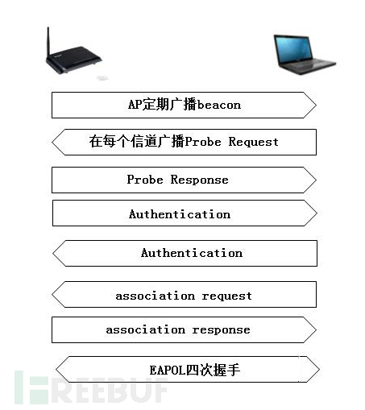

# WIFI

> `802.11` 是現今無線局域網通用的標準,常見認證方式
>
> - 不啓用安全‍‍
> - `WEP‍‍`
> - `WPA/WPA2-PSK`（預共享密鑰）‍‍
> - `PA/WPA2 802.1X` （`radius` 認證）

## WPA-PSK

認證大致過程如下圖

其中四次握手過程

1. 4次握手開始於驗證器(AP)，它產生一個隨機的值(ANonce)發送給請求者
2. 請求者也產生了它自己的隨機SNonce，然後用這兩個Nonces以及PMK生成了PTK。請求者回復消息2給驗證器,還有一個MIC（message integrity code，消息驗證碼）作爲PMK的驗證
3. 它先要驗證請求者在消息2中發來的MIC等信息，驗證成功後，如果需要就生成GTK。然後發送消息3
4. 請求者收到消息3，驗證MIC，安裝密鑰，發送消息4，一個確認信息。驗證器收到消息4，驗證MIC，安裝相同的密鑰

## 例題  

> 實驗吧： `shipin.cap`

從大量的`Deauth` 攻擊基本可以判斷是一個破解 `wifi` 時的流量攻擊

同時也成功發現了握手包信息

接下來跑密碼

- `linux` ： `aircrack` 套件
- `windows` ： `wifipr` ，速度比 `esaw` 快， `GTX850` 能將近 `10w\s  :`)

得到密碼`88888888`在 `wireshark` 中`Edit -> Preferences -> Protocols -> IEEE802.11 -> Edit`以`key:SSID`形式填入即可解密 `wifi` 包看到明文流量

> KCARCK相關: https://www.krackattacks.com/

## 參考文獻

- http://www.freebuf.com/articles/wireless/58342.html
- http://blog.csdn.net/keekjkj/article/details/46753883