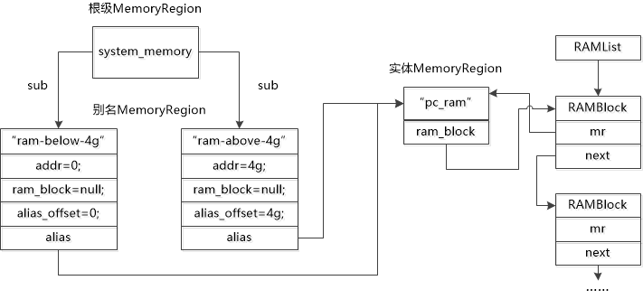

# QEMU 內存管理

本節講述 QEMU 如何管理某個特定 VM 的內存。

## Guest VM 視角（GPA）

### MemoryRegion：Guest 視角的一塊“內存”

在 Qemu 當中使用 `MemoryRegion` 結構體類型來表示一塊具體的 Guest 物理內存區域，該結構體定義於 `include/exec/memory.h` 當中：

```c
/** MemoryRegion:
 *
 * 表示一塊內存區域的一個結構體.
 */
struct MemoryRegion {
    Object parent_obj;

    /* private: */

    /* The following fields should fit in a cache line */
    bool romd_mode;
    bool ram;
    bool subpage;
    bool readonly; /* For RAM regions */
    bool nonvolatile;
    bool rom_device;
    bool flush_coalesced_mmio;
    bool global_locking;
    uint8_t dirty_log_mask;
    bool is_iommu;
    RAMBlock *ram_block;
    Object *owner;

    const MemoryRegionOps *ops;
    void *opaque;
    MemoryRegion *container;	// 指向父 MemoryRegion
    Int128 size;	// 內存區域大小
    hwaddr addr;	// 在父 MR 中的偏移量
    void (*destructor)(MemoryRegion *mr);
    uint64_t align;
    bool terminates;
    bool ram_device;
    bool enabled;
    bool warning_printed; /* For reservations */
    uint8_t vga_logging_count;
    MemoryRegion *alias;	// 僅在 alias MR 中，指向實際的 MR
    hwaddr alias_offset;
    int32_t priority;
    QTAILQ_HEAD(, MemoryRegion) subregions;
    QTAILQ_ENTRY(MemoryRegion) subregions_link;
    QTAILQ_HEAD(, CoalescedMemoryRange) coalesced;
    const char *name;
    unsigned ioeventfd_nb;
    MemoryRegionIoeventfd *ioeventfds;
};
```

在 Qemu 當中有三種類型的 MemoryRegion：

- MemoryRegion 根：通過 `memory_region_init()` 進行初始化，其用以表示與管理由多個 sub-MemoryRegion 組成的一個內存區域，並不實際指向一塊內存區域，例如 `system_memory`。
- MemoryRegion 實體：通過 `memory_region_init_ram()` 初始化，表示具體的一塊大小爲 size 的內存空間，指向一塊具體的內存。
- MemoryRegion 別名：通過 `memory_region_init_alias()` 初始化，作爲另一個 MemoryRegion 實體的別名而存在，不指向一塊實際內存。

MR 容器與 MR 實體間構成樹形結構，其中容器爲根節點而實體爲子節點：

```
                            struct MemoryRegion
                            +------------------------+                                         
                            |name                    |                                         
                            |  (const char *)        |                                         
                            +------------------------+                                         
                            |addr                    |                                         
                            |  (hwaddr)              |                                         
                            |size                    |                                         
                            |  (Int128)              |                                         
                            +------------------------+                                         
                            |subregions              |                                         
                            |    QTAILQ_HEAD()       |                                         
                            +------------------------+                                         
                                       |
                                       |
               ----+-------------------+---------------------+----
                   |                                         |
                   |                                         |
                   |                                         |

     struct MemoryRegion                            struct MemoryRegion
     +------------------------+                     +------------------------+
     |name                    |                     |name                    |
     |  (const char *)        |                     |  (const char *)        |
     +------------------------+                     +------------------------+
     |addr                    |                     |addr                    |
     |  (hwaddr)              |                     |  (hwaddr)              |
     |size                    |                     |size                    |
     |  (Int128)              |                     |  (Int128)              |
     +------------------------+                     +------------------------+
     |subregions              |                     |subregions              |
     |    QTAILQ_HEAD()       |                     |    QTAILQ_HEAD()       |
     +------------------------+                     +------------------------+
```

相應地，基於 OOP 的思想，MemoryRegion 的成員函數被封裝在函數表 `MemoryRegionOps` 當中：

```c
/*
 * Memory region callbacks
 */
struct MemoryRegionOps {
    /* 從內存區域上讀. @addr 與 @mr 有關; @size 單位爲字節. */
    uint64_t (*read)(void *opaque,
                     hwaddr addr,
                     unsigned size);
    /* 往內存區域上寫. @addr 與 @mr 有關; @size 單位爲字節. */
    void (*write)(void *opaque,
                  hwaddr addr,
                  uint64_t data,
                  unsigned size);

    MemTxResult (*read_with_attrs)(void *opaque,
                                   hwaddr addr,
                                   uint64_t *data,
                                   unsigned size,
                                   MemTxAttrs attrs);
    MemTxResult (*write_with_attrs)(void *opaque,
                                    hwaddr addr,
                                    uint64_t data,
                                    unsigned size,
                                    MemTxAttrs attrs);

    enum device_endian endianness;
    /* Guest可見約束: */
    struct {
        /* 若非 0，則指定了超出機器檢查範圍的訪問大小界限
         */
        unsigned min_access_size;
        unsigned max_access_size;
        /* If true, unaligned accesses are supported.  Otherwise unaligned
         * accesses throw machine checks.
         */
         bool unaligned;
        /*
         * 若存在且 #false, 則該事務不會被設備所接受
         * (並導致機器的相關行爲，例如機器檢查異常).
         */
        bool (*accepts)(void *opaque, hwaddr addr,
                        unsigned size, bool is_write,
                        MemTxAttrs attrs);
    } valid;
    /* 內部應用約束: */
    struct {
        /* 若非 0，則決定了最小的實現的 size .
         * 更小的 size 將被向上迴繞，且將返回部分結果.
         */
        unsigned min_access_size;
        /* 若非 0，則決定了最大的實現的 size . 
         * 更大的 size 將被作爲一系列的更小的 size 的訪問而完成.
         */
        unsigned max_access_size;
        /* 若爲 true, 支持非對齊的訪問.  
         * 否則所有的訪問都將被轉換爲（可能多種）對齊的訪問.
         */
        bool unaligned;
    } impl;
};
```

當我們的 Guest 要讀寫虛擬機上的內存時，在 Qemu 內部實際上會調用 `address_space_rw()`，對於一般的 RAM 內存而言則直接對 MR 對應的內存進行操作，對於 MMIO 而言則最終調用到對應的 `MR->ops->read()` 或 `MR->ops->write()`。

同樣的，爲了統一接口，在 Qemu 當中 **PMIO 的實現同樣是通過 MemoryRegion 來完成的**，我們可以把一組端口理解爲 QEMU 視角的一塊 Guest 內存。

> 幾乎所有的 CTF QEMU Pwn 題都是自定義一個設備並定義相應的 MMIO/PMIO 操作。

### FlatView：MR 樹對應的 Guest 視角物理地址空間

`FlatView` 用來表示**一棵 MemoryRegion 樹所表示的 Guest 地址空間**，其使用一個 `FlatRange` 結構體指針數組來存儲不同 `MemoryRegion` 對應的地址信息，每個 `FlatRange` 表示單個 `MemoryRegion` 的 **Guest 視角的一塊物理地址空間**以及是否只讀等特性信息， `FlatRange` 之間所表示的地址範圍不會重疊。

```c
/* Range of memory in the global map.  Addresses are absolute. */
struct FlatRange {
    MemoryRegion *mr;
    hwaddr offset_in_region;
    AddrRange addr;
    uint8_t dirty_log_mask;
    bool romd_mode;
    bool readonly;
    bool nonvolatile;
};

//...

/* Flattened global view of current active memory hierarchy.  Kept in sorted
 * order.
 */
struct FlatView {
    struct rcu_head rcu;
    unsigned ref;
    FlatRange *ranges;
    unsigned nr;
    unsigned nr_allocated;
    struct AddressSpaceDispatch *dispatch;
    MemoryRegion *root;
};
```

### AddressSpace：不同類型的 Guest 地址空間

`AddressSpace` 結構體用以表示 **Guest 視角不同類型的地址空間**，在 x86 下其實就只有兩種：`address_space_memory` 與 `address_space_io`。

單個 `AddressSpace` 結構體與一棵 MemoryRegion 樹的根節點相關聯，並使用一個 `FlatView` 結構體建立該樹的平坦化內存空間。

```c
/**
 * struct AddressSpace: describes a mapping of addresses to #MemoryRegion objects
 */
struct AddressSpace {
    /* private: */
    struct rcu_head rcu;
    char *name;
    MemoryRegion *root;

    /* Accessed via RCU.  */
    struct FlatView *current_map;

    int ioeventfd_nb;
    struct MemoryRegionIoeventfd *ioeventfds;
    QTAILQ_HEAD(, MemoryListener) listeners;
    QTAILQ_ENTRY(AddressSpace) address_spaces_link;
};
```

最終我們可以得到如下總覽圖：


## host VMM 視角（HVA）

### RAMBlock：MR 對應的 Host 虛擬內存

`RAMBlock` 結構體用來表示**單個實體 MemoryRegion 所佔用的 Host 虛擬內存信息**，多個 `RAMBlock` 結構體之間構成單向鏈表。

比較重要的成員如下：

- `mr`：該 RAMBlock 對應的 MemoryRegion（即 HVA → GPA）
- `host`：GVA 對應的 HVA，通常由 QEMU 通過 `mmap()` 獲得（如果未使用 KVM）

```c
struct RAMBlock {
    struct rcu_head rcu;
    struct MemoryRegion *mr;
    uint8_t *host;
    uint8_t *colo_cache; /* For colo, VM's ram cache */
    ram_addr_t offset;
    ram_addr_t used_length;
    ram_addr_t max_length;
    void (*resized)(const char*, uint64_t length, void *host);
    uint32_t flags;
    /* Protected by iothread lock.  */
    char idstr[256];
    /* RCU-enabled, writes protected by the ramlist lock */
    QLIST_ENTRY(RAMBlock) next;
    QLIST_HEAD(, RAMBlockNotifier) ramblock_notifiers;
    int fd;
    size_t page_size;
    /* dirty bitmap used during migration */
    unsigned long *bmap;
    /* bitmap of already received pages in postcopy */
    unsigned long *receivedmap;

    /*
     * bitmap to track already cleared dirty bitmap.  When the bit is
     * set, it means the corresponding memory chunk needs a log-clear.
     * Set this up to non-NULL to enable the capability to postpone
     * and split clearing of dirty bitmap on the remote node (e.g.,
     * KVM).  The bitmap will be set only when doing global sync.
     *
     * It is only used during src side of ram migration, and it is
     * protected by the global ram_state.bitmap_mutex.
     *
     * NOTE: this bitmap is different comparing to the other bitmaps
     * in that one bit can represent multiple guest pages (which is
     * decided by the `clear_bmap_shift' variable below).  On
     * destination side, this should always be NULL, and the variable
     * `clear_bmap_shift' is meaningless.
     */
    unsigned long *clear_bmap;
    uint8_t clear_bmap_shift;

    /*
     * RAM block length that corresponds to the used_length on the migration
     * source (after RAM block sizes were synchronized). Especially, after
     * starting to run the guest, used_length and postcopy_length can differ.
     * Used to register/unregister uffd handlers and as the size of the received
     * bitmap. Receiving any page beyond this length will bail out, as it
     * could not have been valid on the source.
     */
    ram_addr_t postcopy_length;
};
```

對應關係如下圖所示：



## REFERENCE

[understanding qemu - MemoryRegion](https://richardweiyang-2.gitbook.io/understanding_qemu/00-as/02-memoryregion)

[QEMU內存分析（一）：內存虛擬化關鍵結構體](https://www.cnblogs.com/edver/p/14470706.html)

[QEMU的內存模擬](https://66ring.github.io/2021/04/13/universe/qemu/qemu_softmmu/)

[QEMU的內存模型](https://richardweiyang-2.gitbook.io/kernel-exploring/00-kvm/01-memory_virtualization/01_1-qemu_memory_model)

[【VIRT.0x00】Qemu - I：Qemu 簡易食用指南](https://arttnba3.cn/2022/07/15/VIRTUALIZATION-0X00-QEMU-PART-I/)
