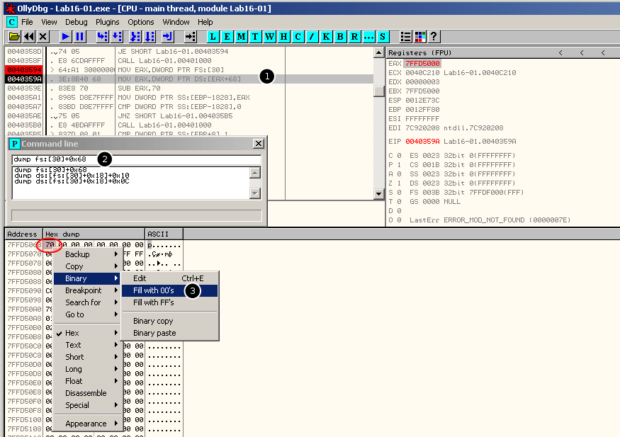

# NtGlobalFlag

## 關於NtGlobalFlag

在32位機器上, `NtGlobalFlag`字段位於`PEB`(進程環境塊)`0x68`的偏移處, 64位機器則是在偏移`0xBC`位置. 該字段的默認值爲0. 當調試器正在運行時, 該字段會被設置爲一個特定的值. 儘管該值並不能十分可信地表明某個調試器真的有在運行, 但該字段常出於該目的而被使用.

該字段包含有一系列的標誌位. 由調試器創建的進程會設置以下標誌位:

```c
FLG_HEAP_ENABLE_TAIL_CHECK (0x10)
FLG_HEAP_ENABLE_FREE_CHECK (0x20)
FLG_HEAP_VALIDATE_PARAMETERS (0x40)
```

## 檢測代碼

因此, 可以檢查這幾個標誌位來檢測調試器是否存在. 比如用形如以下的32位的代碼在32位機器上進行檢測:

``` asm
mov eax, fs:[30h] ;Process Environment Block
mov al, [eax+68h] ;NtGlobalFlag
and al, 70h
cmp al, 70h
je being_debugged
```

以下是64位的代碼在64位機器上的檢測代碼:

``` asm
push 60h
pop rsi
gs:lodsq                ;Process Environment Block
mov al, [rsi*2+rax-14h] ;NtGlobalFlag
and al, 70h
cmp al, 70h
je being_debugged
```

要注意的是, 如果是一個32位程序在64位機器上運行, 那麼實際上會存在兩個PEB: 一個是32位部分的而另一個是64位. 64位的PEB的對應字段也會像在32位的那樣而改變.

於是我們就還有以下的, 用32位的代碼檢測64位機器環境:

```
mov eax, fs:[30h] ; Process Environment Block
;64-bit Process Environment Block
;follows 32-bit Process Environment Block
mov al, [eax+10bch] ;NtGlobalFlag
and al, 70h
cmp al, 70h
je being_debugged
```

切記不要在沒有掩蓋其他位的情況下直接進行比較, 那樣會無法檢測到調試器.

在`ExeCryptor`就有使用`NtGlobalFlag`來檢測調試器, 不過`NtGlobalFlag`的那3個標誌位只有當程序是`由調試器創建`, 而非`由調試器附加`上去的進程時, 纔會被設置.

## 改變NtGlobalFlag初值

當然繞過這種檢測的方法也十分簡單, 那就是調試器想辦法將該字段重新設置爲0. 然而這個默認的初值可以用以下四種方法任意一種改變:

1. 註冊表`HKLM\System\CurrentControlSet\Control\SessionManager`的`GlobalFlag`的值會替換進行`NtGlobalFlag`字段. 儘管它隨後還可能由Windows改變(以下會介紹), 註冊表鍵值會對系統中所有進程產生影響並在重啓後生效.

    

    當然這也產生了另一種檢測調試器的方法: 如果一個調試器爲了隱藏自己, 而將註冊表中的鍵值複製到`NtGlobalFlag`字段中, 然而註冊表中的鍵值事先已經替換並且尚未重啓生效. 那麼調試器只是複製了一個假的值, 而非真正需要的那個. 如果程序知道真正的值而非註冊表中的那個假的值, 那麼就可以察覺到調試器的存在.

    當然調試器也可以運行其他進程然後查詢`NtGlobalFlag`字段來獲取真正的值.

2. 依舊是`GlobalFlag`, 不過這裏的是`HKLM\Software\Microsoft\Windows NT\CurrentVersion\Image File Execution Options\<filename>`. (映像劫持), 這裏需要將`<filename>`替換爲需要更改的可執行文件的文件名(不需要指定路徑). 設置好`GlobalFlag`後, 系統會將其值覆蓋到`NtGlobalFlag`字段(只單獨爲指定的進程覆蓋). 不過也還是可以再次由Windows改變(見下).
3. 在加載配置表(`Load Configuration Table`)的兩個字段: `GlobalFlagsClear`和`GlobalFlagsSet`.

    `GlobalFlagsClear`列出需要清空的標誌位, 而`GlobalFlagsSet`則列出需要設置的標誌位, 這些設置會在`GlobalFlag`應用之後再生效, 因此它可以覆蓋掉`GlobalFlag`指定的值. 然而它無法覆蓋掉Windows指定設置的標誌位. 比如設置`FLG_USER_STACK_TRACE_DB (0x1000)`可以讓Windows設置`FLG_HEAP_VALIDATE_PARAMETERS (0x40)`標誌位, 就算`FLG_HEAP_VALIDATE_PARAMETERS`在加載配置表(`Load Configuration Table`)中被清空了, Windows也會在隨後的進程加載過程中重新設置.

4. 當調試器創建進程時, Windows會做出一些改變. 通過設置環境變量中的`_NO_DEBUG_HEAP`, `NtGlobalFlag`將會因爲調試器而不會設置其中的3個堆的標誌位. 當然它們依舊可以通過`GlobalFlag`或加載配置表中的`GlobalFlagsSet`繼續設置.


## 如何繞過檢測?

有以下3種方法來繞過`NtGlobalFlag`的檢測

* 手動修改標誌位的值(`FLG_HEAP_ENABLE_TAIL_CHECK`, `FLG_HEAP_ENABLE_FREE_CHECK`, `FLG_HEAP_VALIDATE_PARAMETERS`)
* 在Ollydbg中使用`hide-debug`插件
* 在Windbg禁用調試堆的方式啓動程序(`windbg -hd program.exe`)

## 手動繞過示例

以下是一個演示如何手動繞過檢測的示例

``` asm
.text:00403594     64 A1 30 00 00 00          mov     eax, large fs:30h   ; PEB struct loaded into EAX
.text:0040359A                                db      3Eh                 ; IDA Pro display error (the byte is actually used in the next instruction)
.text:0040359A     3E 8B 40 68                mov     eax, [eax+68h]      ; NtGlobalFlag (offset 0x68 relative to PEB) saved to EAX
.text:0040359E     83 E8 70                   sub     eax, 70h            ; Value 0x70 corresponds to all flags on (FLG_HEAP_ENABLE_TAIL_CHECK, FLG_HEAP_ENABLE_FREE_CHECK, FLG_HEAP_VALIDATE_PARAMETERS)
.text:004035A1     89 85 D8 E7 FF FF          mov     [ebp+var_1828], eax
.text:004035A7     83 BD D8 E7 FF FF 00       cmp     [ebp+var_1828], 0   ; Check whether 3 debug flags were on (result of substraction should be 0 if debugged)
.text:004035AE     75 05                      jnz     short loc_4035B5    ; No debugger, program continues...
.text:004035B0     E8 4B DA FF FF             call    s_selfDelete        ; ...else, malware deleted
```

在Ollydbg中在偏移`0x40359A`設置斷點, 運行程序觸發斷點. 然後打開`CommandLine`插件用`dump fs:[30]+0x68`dump出`NtGlobalFlag `的內容



右鍵選擇`Binary->Fill with 00's`將值`0x70`替換爲`0x00`即可.

## 參考鏈接

* [The "Ultimate" Anti-Debugging Reference](http://anti-reversing.com/Downloads/Anti-Reversing/The_Ultimate_Anti-Reversing_Reference.pdf)
* [PEB-Process-Environment-Block/NtGlobalFlag](https://www.aldeid.com/wiki/PEB-Process-Environment-Block/NtGlobalFlag)
