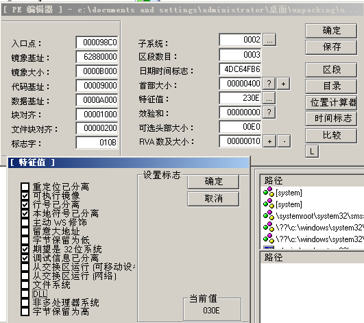
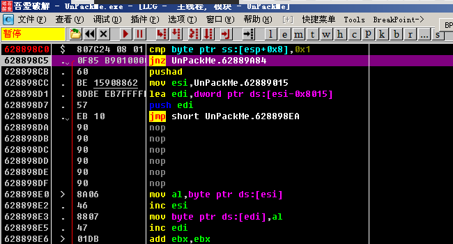

# DLL 文件脫殼

這裏需要聯繫上篇的 [手動查找IAT並使用ImportREC重建](/reverse/unpack/manually-fix-iat/index.html)

例題文件你可以點擊此處下載: [unpack_dll.zip](https://github.com/ctf-wiki/ctf-challenges/blob/master/reverse/unpack/unpack_dll.zip)

因爲`Dll`脫殼需要這一步驟. `Dll`脫殼的最關鍵的步驟在於`使用LordPE修改其Dll的標誌`, 用`LordPE`打開`UnpackMe.dll`, 然後在特徵值那裏點擊`...`, 然後取消勾選`DLL`標誌, 保存後, 系統就會將該文件視作一個可執行文件.

我們將`UnpackMe.dll`後綴名改成`UnpackMe.exe`, 然後用OD載入.

一般在入口點, 程序都會保存一些信息, 這裏就很簡單, 只作了一個`cmp`. 要注意的一點是, 這裏的`jnz`跳轉直接就跳到了`unpacking`過程的末尾. 因此我們需要修改寄存器的`z`標誌來使得跳轉失效. 同時在`unpacking`過程的末尾設下一個斷點以避免脫殼完然後直接運行.(程序會斷在這個斷點上, 但是脫殼已經完成, 代碼都很清晰)

`Dll`脫殼的基本步驟跟`exe`文件脫殼一樣, 而在重建`IAT`時, 需要照着上篇 [手動查找IAT並使用ImportREC重建](/reverse/unpack/manually-fix-iat/index.html) 所說的那樣, 手動找到`IAT`表並用`ImportREC`進行重建. 只是要注意, 在脫殼完dump後, 要記得用LordPE把`DLL`標誌恢復過來並將文件後綴名改爲`.dll`.
