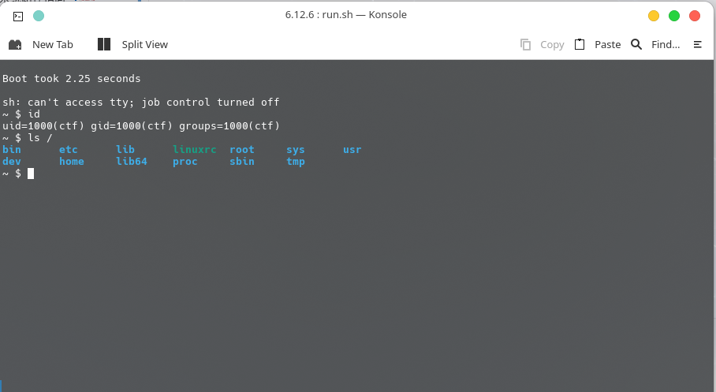
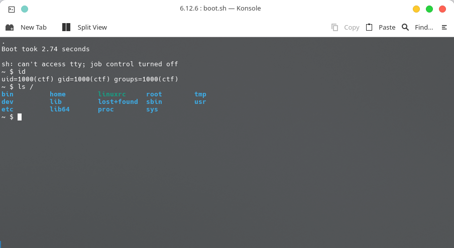

# 搭建内核运行环境

QEMU 是一款开源的虚拟机软件，支持多种不同架构的模拟（Emulation）以及配合 kvm 完成当前架构的虚拟化（Virtualization）的特性，是当前最火热的开源虚拟机软件。

这一章节主要介绍如何使用 QEMU 来搭建调试分析环境。为了使用 qemu 启动和调试内核，我们需要内核、QEMU、文件系统。

## 获取内核镜像文件

我们已经在前面的章节叙述了如何从源码编译内核并获取内核镜像文件，这里不再赘述。

## 获取 QEMU

QEMU 的获取同样分为两种方式：从发行版仓库进行安装以及从源码进行编译。你可以根据自己的需求进行选择。

## 使用 BusyBox 搭建基本的文件系统

[BusyBox](https://www.busybox.net/) 是一个集成了三百多个最常用 Linux 命令和工具的软件，包含了例如 ls 、cat 和 echo 等常见的命令，相比起各大发行版中常用的 [GNU core utilities](https://www.gnu.org/software/coreutils/) ，BusyBox 更加的轻量化，且更容易进行配置，因此我们将用 busybox 为我们的内核提供一个基本的用户环境。

### 下载编译 busybox

> 需要注意的是，在主机使用较新的内核版本的情况下，BusyBox 可能会无法完成编译，这个 Bug 早在 2024 年 1 月便有人 [提交了报告](https://lists.busybox.net/pipermail/busybox-cvs/2024-January/041752.html) ，但直到现在都尚未进行修复。
> 
> 如果你的 BusyBox 编译失败，考虑切换到老内核继续进行，或是选择直接下载预编译版本。

#### 下载 BusyBox 源码

我们首先在 [busybox.net](https://busybox.net/downloads/) 下载自己想要的版本，笔者这里选用 `1.36.0` 版本：

```shell
$ wget https://busybox.net/downloads/busybox-1.36.0.tar.bz2
```

完成后进行解压：

```shell
$ tar -jxvf busybox-1.36.0.tar.bz2 
```

#### 编译 BusyBox

接下来我们配置编译选项，进入到源码根目录运行如下命令进入图形化配置界面：

```shell
$ make menuconfig
```

勾选 `Settings` ---> `Build static binary file (no shared lib)` 以构建不依赖于 libc 的静态编译版本，因为我们的简易内核环境中只有 BusyBox，没有额外的 libc 等运行支持。

> 可选项：在 Linux System Utilities 中取消选中 Support mounting NFS file systems on Linux < 2.6.23 (NEW)；在 Networking Utilities 中取消选中 inetd。

接下来进行编译：

```shell
$ make -j$(nproc)
$ make install
```

编译完成后会生成一个 `_install` 目录，接下来我们将会用它来构建我们的文件系统

### 配置文件系统

我们首先在 `_install` 目录下创建基本的文件系统结构：

```shell
$ cd _install
$ mkdir -pv {bin,sbin,etc,proc,sys,dev,home/ctf,root,tmp,lib64,lib/x86_64-linux-gnu,usr/{bin,sbin}}
$ touch etc/inittab
$ mkdir etc/init.d
$ touch etc/init.d/rcS
$ chmod +x ./etc/init.d/rcS
```

在我们创建的 `./etc/inttab` 中写入如下内容：

```shell
::sysinit:/etc/init.d/rcS
::askfirst:/bin/ash
::ctrlaltdel:/sbin/reboot
::shutdown:/sbin/swapoff -a
::shutdown:/bin/umount -a -r
::restart:/sbin/init
```

在上面的文件中指定了系统初始化脚本，因此接下来配置 `etc/init.d/rcS`，写入如下内容，主要是挂载各种文件系统，以及设置各目录的权限，并创建一个非特权用户：

```bash
#!/bin/sh
chown -R root:root /
chmod 700 /root
chown -R ctf:ctf /home/ctf

mount -t proc none /proc
mount -t sysfs none /sys
mount -t tmpfs tmpfs /tmp
mkdir /dev/pts
mount -t devpts devpts /dev/pts

echo 1 > /proc/sys/kernel/dmesg_restrict
echo 1 > /proc/sys/kernel/kptr_restrict

echo -e "\nBoot took $(cut -d' ' -f1 /proc/uptime) seconds\n"

cd /home/ctf
su ctf -c sh

poweroff -d 0  -f
```

然后为这个脚本添加可执行权限，该脚本通常用作我们自定义的环境初始化脚本：

```shell
$ chmod +x ./etc/init.d/rcS
```

接下来我们配置用户组相关权限，在这里建立了两个用户组 `root` 和 `ctf` ，以及两个用户 `root` 和 `ctf`，并配置了一条文件系统挂载项：

```shell
$ echo "root:x:0:0:root:/root:/bin/sh" > etc/passwd
$ echo "ctf:x:1000:1000:ctf:/home/ctf:/bin/sh" >> etc/passwd
$ echo "root:x:0:" > etc/group
$ echo "ctf:x:1000:" >> etc/group
$ echo "none /dev/pts devpts gid=5,mode=620 0 0" > etc/fstab
```

### 打包文件系统

#### cpio 格式

我们可以在 `_install` 目录下使用如下命令打包文件系统为 cpio 格式：

```shell
$ find . | cpio -o --format=newc > ../rootfs.cpio
```

也可以这么写

```shell
$ find . | cpio -o -H newc > ../rootfs.cpio
```

> 这里的位置是笔者随便选的，也可以将之放到自己喜欢的位置。

当然，我们还可以使用如下的命令重新解包文件系统：

```shell
$ cpio -idv < ./rootfs.cpio$
```

#### ext4 镜像格式

这里也可以将文件系统打包为 ext4 镜像格式，首先创建空白 ext4 镜像文件，这里 `bs` 表示块大小，`count` 表示块的数量：

```shell
$ dd if=/dev/zero of=rootfs.img bs=1M count=32
```

之后将其格式化为 ext4 格式：

```shell
$ mkfs.ext4 rootfs.img 
```

挂载镜像，将文件拷贝进去即可：

```shell
$ mkdir tmp
$ sudo mount rootfs.img ./tmp/
$ sudo cp -rfp _install/* ./tmp/
$ sudo chown -R root:root ./tmp/
$ sudo chmod 700 ./tmp/root
$ sudo chown -R 1000:1000 ./tmp/home/ctf/
$ sudo umount ./tmp
```

## 启动内核

这里以前面编译好的 Linux 内核、文件系统镜像为例来介绍如何启动内核。我们可以直接使用下面的脚本来启动 Linux 内核：

```bash
#!/bin/sh
qemu-system-x86_64 \
    -m 128M \
    -kernel ./bzImage \
    -initrd  ./rootfs.cpio \
    -monitor /dev/null \
    -append "root=/dev/ram rdinit=/sbin/init console=ttyS0 oops=panic panic=1 loglevel=3 quiet kaslr" \
    -cpu kvm64,+smep \
    -smp cores=2,threads=1 \
    -nographic \
    -s
```

各参数说明如下，详细说明可以参照 QEMU 的官方文档：

- `-m`：虚拟机内存大小
- `-kernel`：内核镜像路径
- `-initrd`：初始文件系统路径，cpio 文件系统会被载入到内存当中（initramfs）
- `-monitor`：将监视器重定向到主机设备 `/dev/null`，这里重定向至 null 主要是防止CTF 中被人通过监视器直接拿 flag
- `-append`：内核启动参数选项
    - `root=/dev/ram`：该参数设定了根文件系统所在设备，因为我们使用的是 initramfs 所以文件系统位于内存中
    - `kaslr`：开启内核地址随机化，你也可以改为 `nokaslr` 进行关闭以方便我们进行调试
    - `rdinit`：指定初始启动进程，这里我们指定了 `/sbin/init` 作为初始进程，其会默认以 `/etc/init.d/rcS` 作为启动脚本
    - `loglevel=3` & `quiet`：不输出log
    - `console=ttyS0`：指定终端为 `/dev/ttyS0`，这样一启动就能进入终端界面
- `-cpu`：设置CPU选项，在这里开启了smep保护
- `-smp`：设置对称多处理器配置，这里设置了两个核心，每个核心一个线程
- `-nographic`：不提供图形化界面，此时内核仅有串口输出，输出内容会被 QEMU 重定向至我们的终端
- `-s`：相当于`-gdb tcp::1234`的简写（也可以直接这么写），后续我们可以通过gdb连接本地端口进行调试

启动后的效果如下:



如果你使用了 ext4 文件镜像，则应当修改部分启动参数如下：

```bash
#!/bin/sh
qemu-system-x86_64 \
    -m 128M \
    -kernel ./bzImage \
    -hda  ./rootfs.img \
    -monitor /dev/null \
    -append "root=/dev/sda rw rdinit=/sbin/init console=ttyS0 oops=panic panic=1 loglevel=3 quiet kaslr" \
    -cpu kvm64,+smep \
    -smp cores=2,threads=1 \
    -nographic \
    -s
```

涉及改动的参数如下：

- `-hda`：我们将 ext4 镜像挂载为一个真正的硬盘设备，优点在于更贴近真实环境（同时 flag 不会被在内存中泄漏），缺点在于所有对文件系统的操作都会“落盘”
- `-append`：我们修改了 `root=/dev/sda rw` ，因为 ext4 镜像被挂载为一个 SATA 硬盘，而 Linux 中第一个 SATA 硬盘的路径为 `/dev/sda` ，因此我们将根文件系统路径指向设备路径，并给予可读写权限

启动后的效果如下:



此外，在没有设置 monitor 时，我们可以先按一次 `CTRL + A`、再按一次 `C` 来进入 QEMU monitor，可以看到 monitor 提供了很多有用的命令。

```bash
~ $ QEMU 9.1.2 monitor - type 'help' for more information
(qemu) help
announce_self [interfaces] [id] -- Trigger GARP/RARP announcements
balloon target -- request VM to change its memory allocation (in MB)
block_job_cancel [-f] device -- stop an active background block operation (use -f
                         if you want to abort the operation immediately
                         instead of keep running until data is in sync)
...
```

## 加载驱动

现在我们来加载之前编译的驱动。我们只需要将生成的 ko 文件拷贝到文件系统中，然后在启动脚本中添加 `insmod` 命令即可，具体如下：

```bash
chown -R root:root /
chmod 700 /root
chown -R ctf:ctf /home/ctf

mount -t proc none /proc
mount -t sysfs none /sys
mount -t tmpfs tmpfs /tmp
mkdir /dev/pts
mount -t devpts devpts /dev/pts

echo 1 > /proc/sys/kernel/dmesg_restrict
echo 1 > /proc/sys/kernel/kptr_restrict

insmod /root/a3kmod.ko

echo -e "\nBoot took $(cut -d' ' -f1 /proc/uptime) seconds\n"

cd /root
su root -c sh

poweroff -d 0  -f
```

qemu 启动内核后，我们可以使用 dmesg 查看输出，可以看到确实加载了对应的 ko。

```shell
# dmesg | grep a3kmod
[    5.689366] a3kmod: loading out-of-tree module taints kernel.
[    5.693217] [a3kmod:] Hello kernel world!
```

## 调试分析

这里我们简单介绍一下如何调试内核。

### 调试建议

为了方便调试，我们可以使用 root 用户启动 shell，即修改 init 脚本中对应的代码：

```diff
- su ctf -c sh
+ su root -c sh
```

此外，我们还可以在启动时，指定内核关闭随机化：

```bash
#!/bin/sh
qemu-system-x86_64 \
    -m 128M \
    -kernel ./bzImage \
    -hda  ./rootfs.img \
    -monitor /dev/null \
    -append "root=/dev/sda rw rdinit=/sbin/init console=ttyS0 oops=panic panic=1 loglevel=3 quiet nokaslr" \
    -cpu kvm64,+smep \
    -smp cores=2,threads=1 \
    -nographic \
    -s
```

### 基本操作

我们可以通过 `/proc/kallsyms` 获取特定内核符号的信息：

```shell
# cat /proc/kallsyms | grep prepare_kernel_cred
ffffffffa66d0b90 T __pfx_prepare_kernel_cred
ffffffffa66d0ba0 T prepare_kernel_cred
ffffffffa8061668 r __ksymtab_prepare_kernel_cred
```

通过 `lsmod` 命令可以查看装载的驱动基本信息：

```shell
# lsmod
a3kmod 16384 0 - Live 0xffffffffc008f000 (O)
```

通过读取 `/sys/module` 目录，我们可以获取更为详细的内核模块信息：

```shell
# cat /sys/module/a3kmod/sections/.text 
0xffffffffc008f000
# cat /sys/module/a3kmod/sections/.data 
0xffffffffc0091038
```

### 启动调试

qemu 其实提供了调试内核的接口，我们可以在启动参数中添加 `-gdb dev` 来启动调试服务。最常见的操作为在一个端口监听一个 tcp 连接。 QEMU 同时提供了一个简写的方式 `-s`，表示 `-gdb tcp::1234`，即在 1234 端口开启一个 gdbserver。

当我们以调试模式启动内核后，我们就可以在另外一个终端内使用如下命令来连接到对应的 gdbserver，开始调试。

```shell
gdb -q -ex "target remote localhost:1234"
```

在启动内核后，我们可以在 gdb 中使用 `add-symbol-file` 字命令来添加符号信息，例如：

```shell
pwndbg> add-symbol-file ./test_kmod/src/a3kmod.ko -s .text 0xffffffffc008f000 -s .data 0xffffffffc0091038 -s .bss 0xffffffffc0091540
add symbol table from file "./test_kmod/src/a3kmod.ko" at
        .text_addr = 0xffffffffc008f000
        .data_addr = 0xffffffffc0091038
        .bss_addr = 0xffffffffc0091540
Reading symbols from ./test_kmod/src/a3kmod.ko...
warning: remote target does not support file transfer, attempting to access files from local filesystem.
(No debugging symbols found in ./test_kmod/src/a3kmod.ko)
```

当然，我们也可以添加源码目录信息。这些就和用户态调试没什么区别了。

## kgdb配置

内核提供了专门的调试工具：KGDB（Kernel GNU Debugger）。
使用KGDB需在编译时启用 `CONFIG_KGDB` 配置选项。
在qemu中，可以通过指定一个串口（例如ttyS1）为KGDB提供输出。

```bash
#!/bin/sh
qemu-system-x86_64 \
    -m 64M \
    -kernel ./bzImage \
    -initrd  ./rootfs.img \
    -append "root=/dev/ram rw console=ttyS0 kgdboc=ttyS1,115200 oops=panic panic=1 nokaslr" \
    -smp cores=2,threads=1 \
    -display none \
    -serial stdio \
    -serial tcp::4445,server,nowait \
    -cpu kvm64
```

这里将ttyS0指定为终端的输入输出，ttyS1指定为本地4445端口，不使用qemu虚拟机屏幕显示。

在qemu虚拟机内部通过`echo g > /proc/sysrq-trigger`触发（此外在 append里使用 kgdbwait参数，使内核在启动完毕后自动触发）。

```bash
~ # cat /sys/module/kgdboc/par~ # cat /sys/module/kgdboc/parameters/kgdboc
ttyS1,115200
~ # echo g > /proc/sysrq-triggerameters/kgdboc
ttyS1,115200
~ # echo g > /proc/sysrq-trigger
[    9.078653] sysrq: DEBUG
[    9.081034] KGDB: Entering KGDB
```

在另一个终端使用gdb连接。

```bash
gdb vmlinux
Reading symbols from vmlinux...
(gdb) target remote:4445
Remote debugging using :4445
warning: multi-threaded target stopped without sending a thread-id, using first non-exited thread
[Switching to Thread 4294967294]
kgdb_breakpoint () at kernel/debug/debug_core.c:1092
1092            wmb(); /* Sync point after breakpoint */
(gdb)
```


## 参考

- https://arttnba3.cn/2021/02/21/OS-0X01-LINUX-KERNEL-PART-II/
- https://arttnba3.cn/2022/07/15/VIRTUALIZATION-0X00-QEMU-PART-I/
- https://www.ibm.com/developerworks/cn/linux/l-busybox/index.html
- https://qemu.readthedocs.io/en/latest/system/qemu-manpage.html
- http://blog.nsfocus.net/gdb-kgdb-debug-application/
